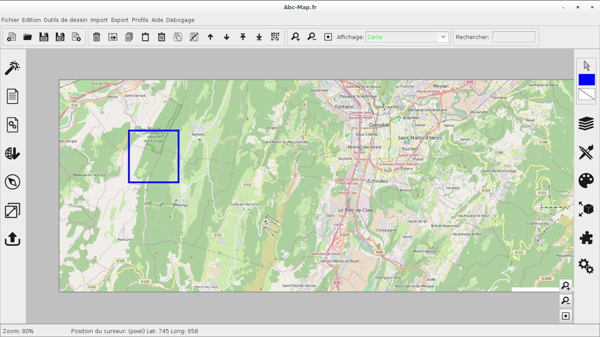
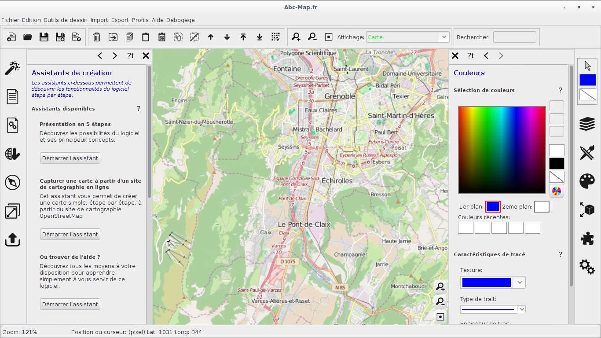
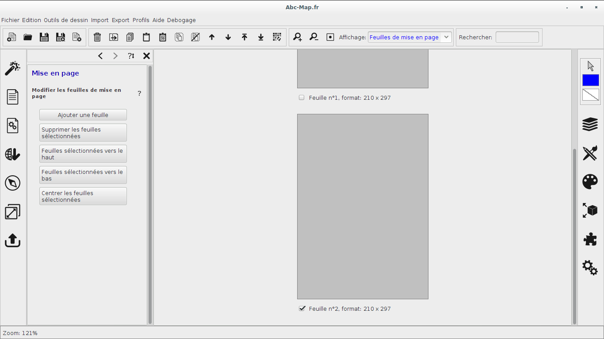

# Abc-Map

The new version of Abc-Map, work in progress :p

## Where is first one ?

https://github.com/remipassmoilesel/Abc-map

## Launch demo

	$ git clone https://github.com/remipassmoilesel/abcmap2
	$ cd abcmap2
	$ git submodule init
	$ git submodule update
	$ cd lib/imagej-surf/
	$ mvn install
	$ cd ../geotools/modules/plugin/imagemosaic-jdbc
	$ mvn install
	$ cd ../..
	$ maven compile
	$ maven exec:exec

## Status

[15/02/2017] Development will be interrupted this summer and will resume this fall.

## Screenshots

